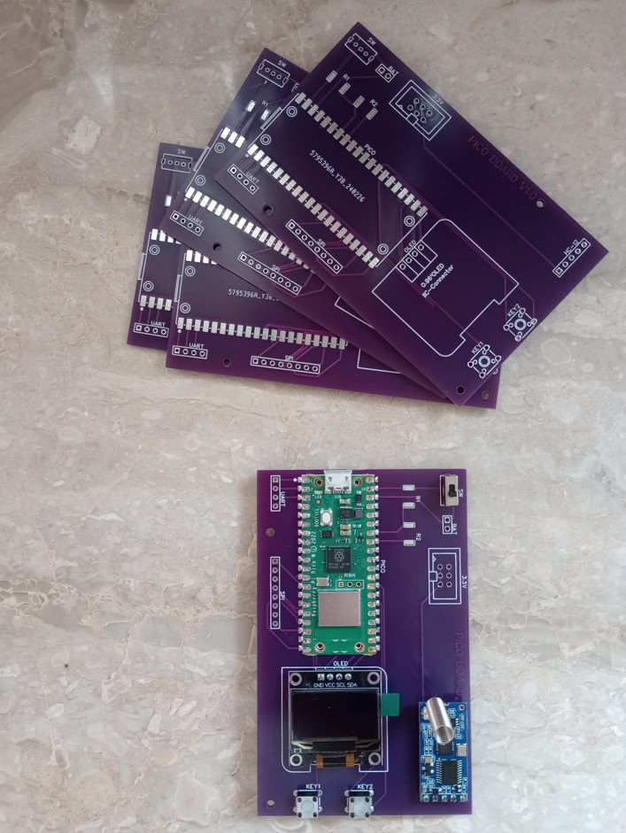

# pico_board

Βασική πλακετούλα με pi pico η οποία έχει μια oled screen, δυο κουμπάκια για input, μπαταρία 18650 για παροχή ισχύος και κύκλωμα φόρτισης μπαταρίας.

- Ο διαιρέτης τάσης χρησιμοποιείται για μέτρηση της τάσης μπαταρίας. Μπορεί να έχει δύο όμοιες αντιστάσεις >10kΩ.
- Υπάρχουν δύο έξοδοι για περιφερειακές συσκευές. Μια στην SPI και η άλλη για I2C ή UART

Το κύκλωμα τροφοδοσίας που αποτελείται από μια μπαταρία 18650 και ένα κύκλωμα φόρτισης τέτοιας μπαταρίας 3.7V από το aliexpress

Η μπροστινή όψη του project με συνδεδεμένο ένα RF module επικοινωνίας CC1101 στην SPI θύρα του pico

**Παράδειγμα Μετάδοσης - Λήψης με CC1101**

Στην περίπτωση που θέλετε να χρησιμοποιήσετε το RF module CC1101, υπάρχουν δύο demo (ένα για λήψη Rx και ένα για μετάδοση Tx) στον κώδικα τα οποία λειτουργούν αλλά δεν έχουν όλες τις λειτουργίες που υπάρχουν σε βιβλιοθήκες για άλλα microcontroller. Στο pico βρήκα μόνο βιβλιοθήκη cc1101 για circuitpython και από εκεί προσπάθησα να προσαρμόσω κώδικα. Για τα υπόλοιπα RF modules (nrf24, Lora) βρίσκεις εύκολα πλήρεις βιβλιοθήκες στο pico. Η συνδεσμολογία στο pico φαίνεται στο σχήμα

**Παράδειγμα Scanner με NRF24**

Η συνδεσμολογία Pin του NRF24 στο board είναι απολύτως όμοια με προηγουμένως. Το demo του rf24 στα αρχεία κάνει χρήση της βιβλιοθήκης nrf24l01.py. Εκτελεί σκανάρισμα στις συχνότητες 2400 - 2525MHz και δείχνει αριθμητικά την δραστηριότητα σε κάθε κομματάκι 5MHz του φάσματος στην oled οθόνη.

**Παράδειγμα για λήψη gps με το module E108 της EBYTE**

To Rx(5) θα συνδεθεί στο GP0 pin του pico και το Tx(4) θα συνδεθεί στο pin GP1 του pico.

**PCB board**

